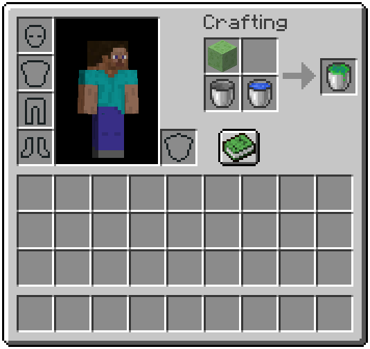
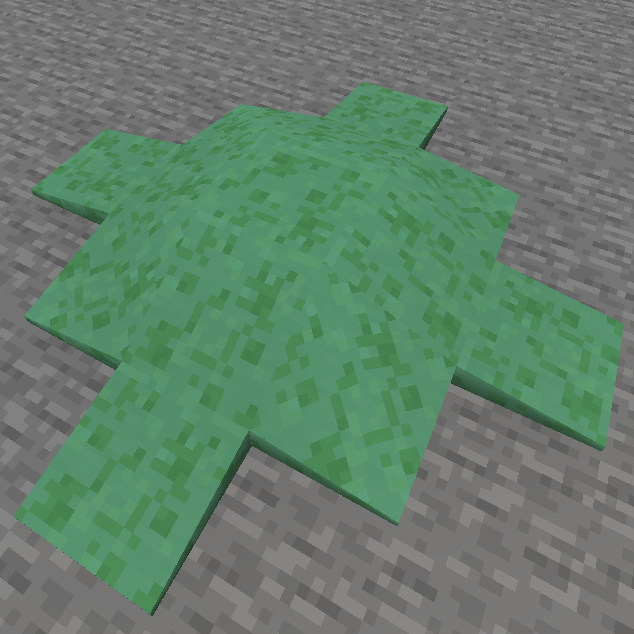
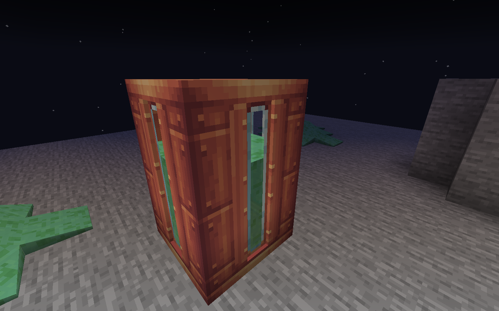

# Bucket of Wet Slop

"The world is in turmoil and people are in pain. Even still, we can take comfort in knowing that there is bucket of wet slop. Grins."  \- Someone (I couldn't be bothered looking up who said this)

### What does this mod do?
 This mod adds a Bucket of Wet Slop. That's it. 
Absolutely prefectly safe slop that won't poision the surrounding environment!

### Where can I find this slop?
 The slop does not appear naturally in the world and instead must be crafted with a *Slime Block*, *Water Bucket* and *Empty Bucket*. The empty bucket is in the recipe because it's not worth writing an entire custom crafting system just to prevent the water bucket from leaving a second empty bucket behind.

### Screenshots below:
  
  

The mod also supports Create: 
 

https://github.com/FrostBird347/Bucket-Of-Wet-Slop/assets/39435218/952adb6f-d582-4920-9b1a-b0facc75c5ef

https://github.com/FrostBird347/Bucket-Of-Wet-Slop/assets/39435218/fc729c98-0332-4d88-a264-038e6c5c4fec
